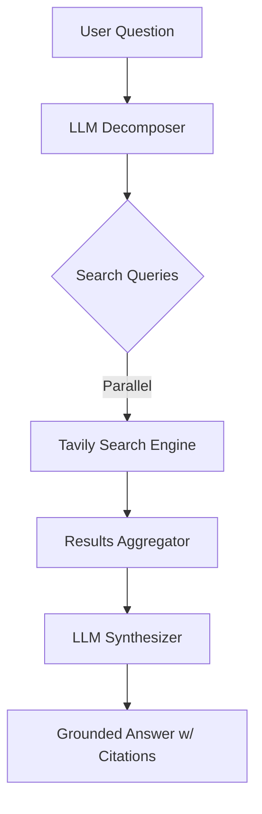

# Worko Research Assistant

A high-performance research assistant that intelligently decomposes complex questions, gathers evidence from academic and factual sources, and synthesizes grounded answers using state-of-the-art LLMs.

## Features
- **Intelligent Question Decomposition**: Breaks down multifaceted queries into 3-5 precise search vectors using Llama 3.1.
- **Tavily AI Search**: Leverages Tavily for high-quality, LLM-optimized web search results across the entire internet.
- **Adaptive Synthesis**: Generates responses with dynamic length:
  - **Factual queries**: Concise, one-line answers.
  - **Descriptive/Complex queries**: Detailed, ~5-line explanations.
- **Grounding & Citations**: Every answer is strictly grounded in retrieved sources with automated citations and source links.
- **Robustness**:
  - **Question Validation**: Enforces length constraints (5-500 characters) and input sanitization.
  - **Error Handling**: Gracefully handles search failures using `Promise.allSettled`.
  - **Rate Limiting**: Backend protection against abuse.

## Tech Stack
- **Frontend**: React 19 (Vite)
- **Backend**: Node.js (Express 5)
- **LLM**: Groq SDK (Llama 3.1 8B Instant)
- **Search Logic**: Tavily AI (@tavily/core) for optimized web retrieval.

## Architecture
The system employs a sequential pipeline with parallelized search execution:



## Setup Instructions

### Prerequisites
- Node.js (v18+)
- A Groq API Key ([console.groq.com](https://console.groq.com/))

### Backend Setup
1. Navigate to `backend/` and install dependencies:
   ```bash
   cd backend && npm install
   ```
2. Configure environment:
   ```bash
   cp .env.example .env
   # Add your GROQ_API_KEY and TAVILY_API_KEY to .env
   ```
3. Run in development:
   ```bash
   npm run dev
   ```

### Frontend Setup
1. Navigate to `frontend/` and install dependencies:
   ```bash
   cd frontend && npm install
   ```
2. Start development server:
   ```bash
   npm run dev
   ```
3. The app defaults to [http://localhost:5173](http://localhost:5173).

## Deployment Notes
- **Infrastructure**: Optimized for deployment on Render (Backend) and Vercel/Netlify (Frontend).
- **Cold Starts**: On free tiers (like Render), the initial request may take ~50s to spin up the instance.
- **API Limits**: Rate limiting is implemented on the backend to prevent API key exhaustion.