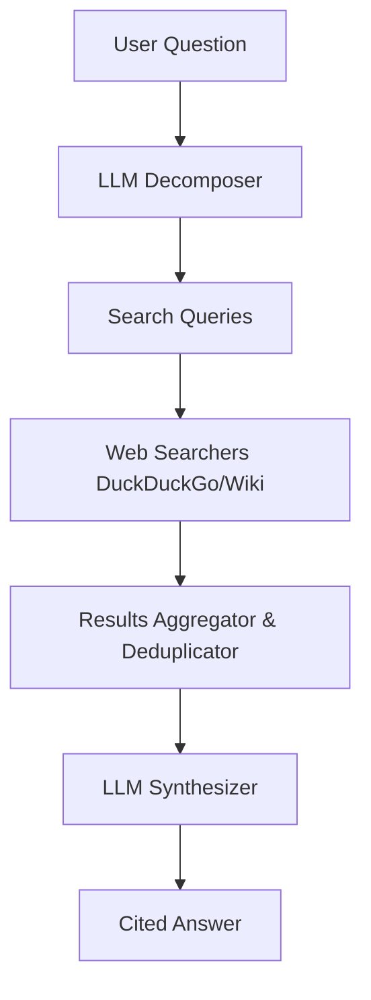

# Worko Research Assistant

A simple research assistant that answers questions using web search and LLM synthesis. This project was built as part of the Worko technical exercise.

## Features
- **Question Decomposition**: Breaks down complex user questions into multiple precise search queries.
- **Web Research**: Gathers information from DuckDuckGo and Wikipedia.
- **LLM Synthesis**: Synthesizes findings into a coherent answer using the Groq (Llama-3.1-8b) model.
- **Automated Citations**: Provides links to the sources used in the answer.
- **Error Handling**: Gracefully handles API errors and insufficient information.

## Tech Stack
- **Frontend**: React (Vite)
- **Backend**: Node.js (Express)
- **LLM**: Groq SDK (Llama 3.1 8B)
- **Search**: DuckDuckGo API (JSON) & Wikipedia API

## Architecture
The system follows a sequential pipeline to ensure high-quality, grounded answers:



## Setup Instructions

### Prerequisites
- Node.js (v18+)
- A Groq API Key (get it at [console.groq.com](https://console.groq.com/))

### Backend Setup
1. Navigate to the `backend` directory:
   ```bash
   cd backend
   ```
2. Install dependencies:
   ```bash
   npm install
   ```
3. Create a `.env` file from the template:
   ```bash
   cp .env.example .env
   ```
4. Add your `GROQ_API_KEY` to the `.env` file.
5. Start the development server:
   ```bash
   npm run dev
   ```

### Frontend Setup
1. Navigate to the `frontend` directory:
   ```bash
   cd frontend
   ```
2. Install dependencies:
   ```bash
   npm install
   ```
3. Start the development server:
   ```bash
   npm run dev
   ```
4. Open the application at [http://localhost:5173](http://localhost:5173).

## Design Decisions
- **LLM Selection**: Chose `llama-3.1-8b-instant` via Groq for high-speed inference and excellent instruction following.
- **Search Strategy**: Used DuckDuckGo as the primary source for broad web coverage, with Wikipedia as a fallback for factual/encyclopedic queries.
- **Minimalist UI**: Focused on a clean, functional interface that highlights the research flow and sources.
- **Safety**: Prompt engineering ensures the assistant only uses provided sources and admits if information is lacking.